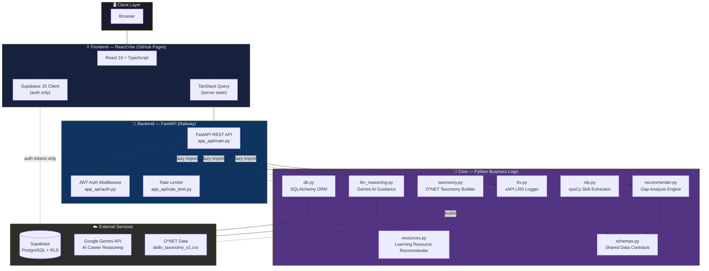
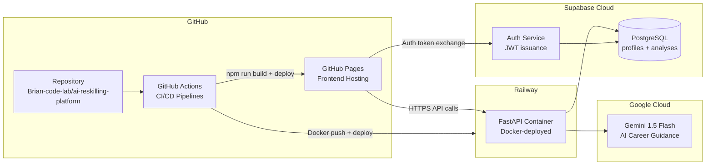
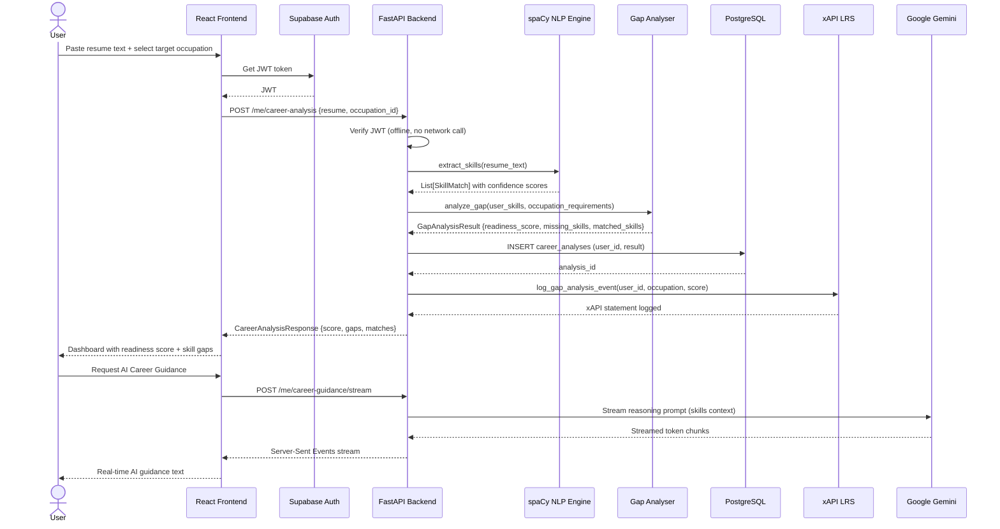
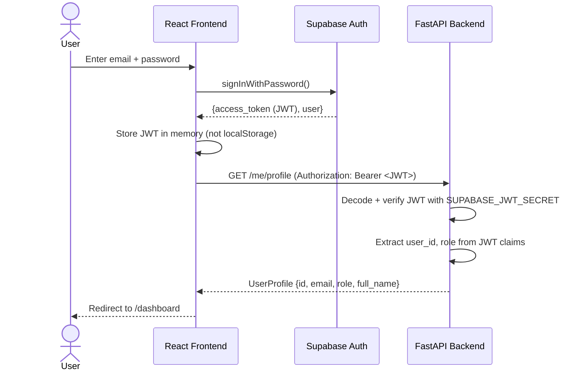
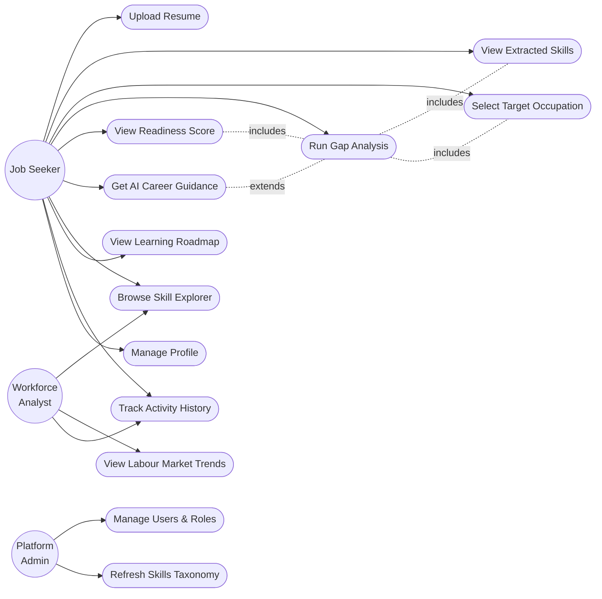
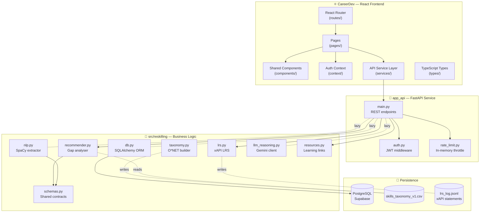
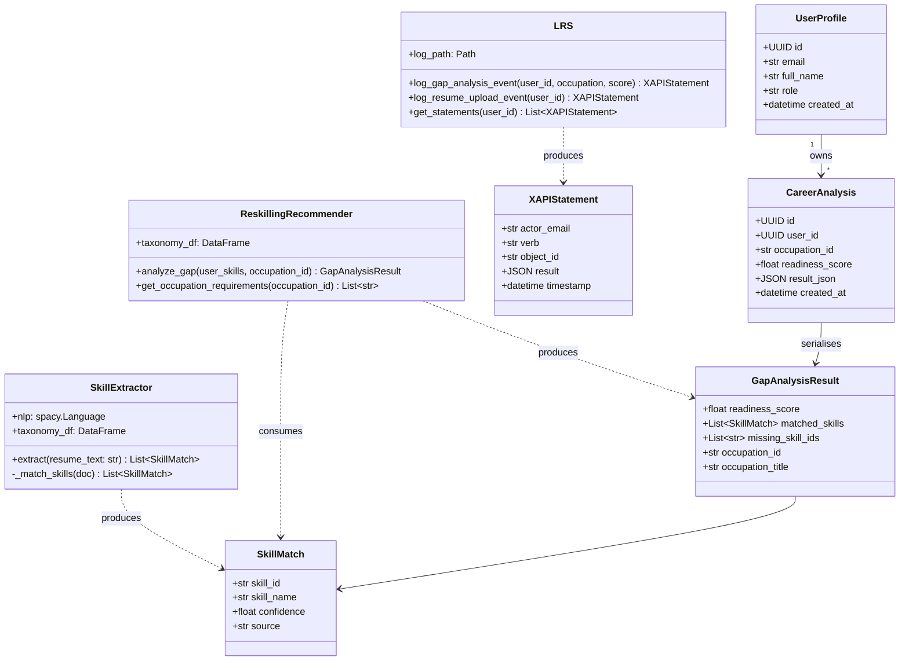
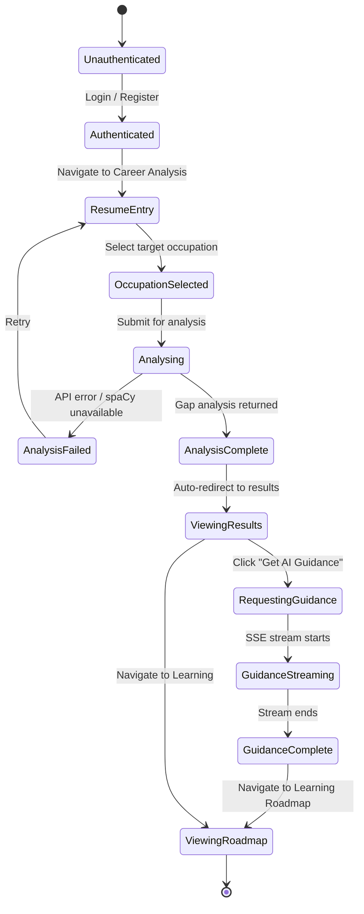
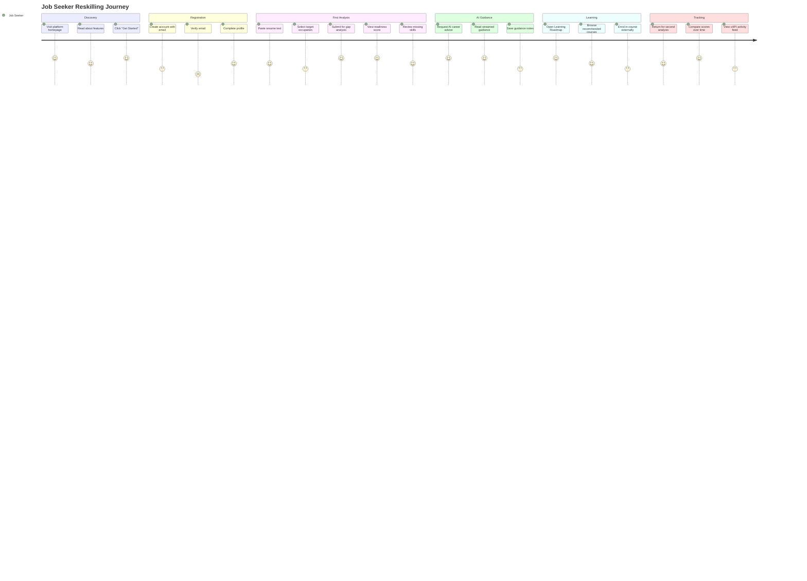
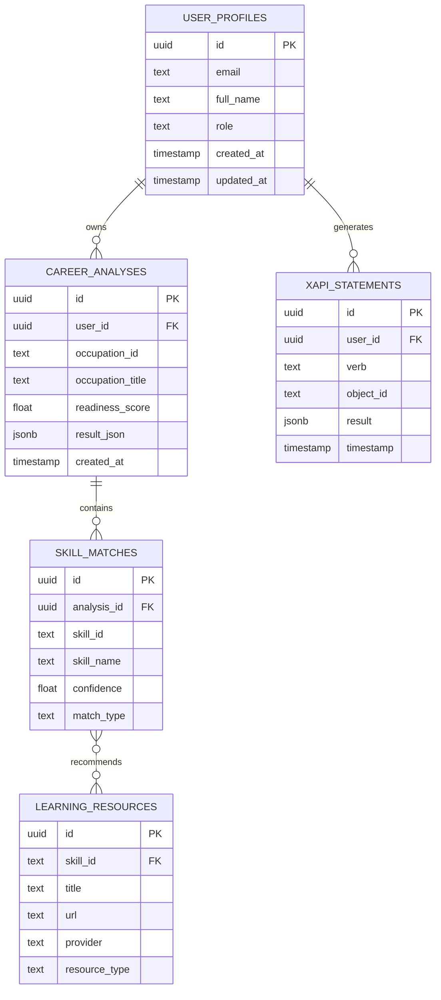

# 🧠 AI Reskilling Think Tank Platform

<div align="center">

**Grounded skills-gap analysis and AI-powered reskilling pathways for workers navigating AI-driven automation.**

[](https://github.com/Brian-code-lab/reskilling-platform/actions/workflows/backend-ci.yml)
[](https://github.com/munenejoel388/CareerDev/actions/workflows/frontend-ci.yml)
[](https://github.com/munenejoel388/CareerDev/actions/workflows/deploy.yml)
[](./LICENSE)
[](https://www.python.org/)
[](https://fastapi.tiangolo.com/)
[](https://react.dev/)
[](https://www.typescriptlang.org/)

[**🚀 Live App**](https://munenejoel388.github.io/CareerDev/) &nbsp;|&nbsp;
[**📖 API Docs**](https://ai-reskilling-api.up.railway.app/docs) &nbsp;|&nbsp;
[**🐛 Report Bug**](https://github.com/Brian-code-lab/reskilling-platform/issues/new?template=bug_report.md) &nbsp;|&nbsp;
[**💡 Request Feature**](https://github.com/Brian-code-lab/reskilling-platform/issues/new?template=feature_request.md)

</div>

---

## 📋 Table of Contents

- [Problem Statement](#-problem-statement)
- [Solution](#-solution)
- [Target Users](#-target-users)
- [Key Features](#-key-features)
- [Technology Stack](#-technology-stack)
- [System Architecture](#-system-architecture)
- [Data Flow](#-data-flow)
- [UML Diagrams](#-uml-diagrams)
- [ER Diagram](#-entity-relationship-diagram)
- [API Documentation](#-api-documentation)
- [Installation Guide](#-installation-guide)
- [Docker Quick Start](#-docker-quick-start)
- [Environment Variables](#-environment-variables)
- [Folder Structure](#-folder-structure)
- [Contributing](#-contributing)
- [License](#-license)

---

## 🔴 Problem Statement

Automation and AI are reshaping the labour market at an unprecedented pace. Workers in clerical, manufacturing, and routine cognitive roles face displacement, yet lack structured, evidence-based tools to:

- Understand **which specific skills they already have** versus what the target occupation demands
- Receive **personalised, AI-reasoned guidance** rather than generic advice
- Track their **reskilling progress** against a verifiable skills taxonomy grounded in O\*NET / ESCO data

Existing platforms either offer generic career advice without skills evidence, or require institutional access. There is no open, data-driven, AI-augmented reskilling tool built for individual workers.

---

## 💡 Solution

The **AI Reskilling Think Tank Platform** is a full-stack application that:

1. **Extracts skills** from a user's resume using spaCy NLP matched against a curated O\*NET skills taxonomy
2. **Performs gap analysis** — comparing extracted skills to the requirements of any target occupation
3. **Generates a readiness score** and prioritised list of missing skills
4. **Delivers AI career guidance** via Google Gemini with real-time streaming
5. **Recommends learning resources** (courses, certifications) for each skill gap
6. **Logs all activity** to an xAPI-compliant Learning Record Store for auditability

---

## 👥 Target Users

| User Type | Description |
|---|---|
| **Job Seeker** | Individuals facing displacement who want a clear reskilling roadmap |
| **Workforce Analyst** | NGO staff / policy researchers consuming aggregate skills data |
| **Platform Administrator** | Manages taxonomy refreshes, user roles, and system health |

---

## ✨ Key Features

- 📄 **Resume Skill Extraction** — NLP-powered extraction of skills from free-text resumes
- 📊 **Gap Analysis** — Deterministic comparison of your skills vs. any O\*NET occupation
- 🤖 **AI Career Guidance** — Real-time streamed guidance from Google Gemini
- 🗺️ **Learning Roadmap** — Personalised course recommendations per skill gap
- 🔍 **Skill Explorer** — Browse all 900+ O\*NET occupations and their skill requirements
- 📈 **Dashboard** — Career analysis history, progress tracking, xAPI activity feed
- 🔐 **Authentication** — Supabase-backed registration, login, and JWT-protected API
- 🛡️ **Role-Based Access Control** — Job Seeker, Analyst, and Admin roles
- 👑 **Admin Panel** — User management, role assignment
- 📝 **xAPI LRS** — Every significant action is logged to an xAPI-compliant Learning Record Store

---

## 🛠️ Technology Stack

### Frontend
| Technology | Version | Purpose |
|---|---|---|
| React | 19 | UI framework |
| TypeScript | 6 | Type safety |
| Vite | 8 | Build tool & dev server |
| Tailwind CSS | 4 | Utility-first styling |
| React Router | 7 | Client-side routing |
| TanStack Query | 5 | Server state management |
| Supabase JS | 2 | Authentication client |
| Lucide React | 1.22 | Icon library |

### Backend
| Technology | Version | Purpose |
|---|---|---|
| Python | 3.11 | Runtime |
| FastAPI | 0.111 | REST API framework |
| uvicorn | 0.30 | ASGI server |
| spaCy | 3.7 | NLP skill extraction (`en_core_web_md`) |
| SQLAlchemy | 2.0 | ORM / database layer |
| PyJWT | 2.9 | JWT verification (offline, no Supabase network call) |
| Google GenAI | 0.3 | Gemini API client for AI career guidance |
| Pandas | 2.2 | Skills taxonomy processing |
| scikit-learn | 1.4 | Similarity scoring for skill matching |
| Ruff | latest | Linting & formatting |
| pytest | latest | 86-test automated test suite |

### Database & Auth
| Technology | Purpose |
|---|---|
| Supabase | Hosted PostgreSQL + Row Level Security + Auth |
| PostgreSQL | Persistent storage for profiles, analyses, xAPI statements |

### Infrastructure
| Technology | Purpose |
|---|---|
| Docker | Containerization |
| Docker Compose | Multi-service orchestration |
| GitHub Actions | CI/CD pipelines |
| GitHub Pages | Frontend hosting |
| Railway | Backend hosting (Docker-native) |
| Nginx | Static file serving + SPA routing |

### External Data Sources
| Source | Usage |
|---|---|
| O\*NET | Skills taxonomy (900+ occupations, 35,000+ skill requirements) |
| ESCO | European skills/competences framework cross-reference |
| BLS | Bureau of Labour Statistics labour market trends |
| ILO | International Labour Organisation occupation data |

---

## 🏗️ System Architecture

### High-Level Architecture



### Deployment Architecture



---

## 🔄 Data Flow

### Career Analysis Flow



### Authentication Flow



---

## 📐 UML Diagrams

### Use Case Diagram



### Component Diagram



### Class Diagram (Core Domain)



### State Diagram — Career Analysis Lifecycle



### User Journey Diagram



---

## 📊 Entity Relationship Diagram



---

## 📡 API Documentation

Base URL: `https://ai-reskilling-api.up.railway.app`  
Interactive docs: `/docs` (Swagger UI) · `/redoc` (ReDoc)

### Authentication
All `/me/*` and `/admin/*` endpoints require:
```
Authorization: Bearer <supabase-jwt-token>
```

### Public Endpoints (no auth required)

| Method | Endpoint | Description |
|---|---|---|
| `GET` | `/health` | Health check → `{"status":"ok"}` |
| `GET` | `/taxonomy/stats` | Occupation count, skill count totals |
| `GET` | `/occupations` | List all 900+ O\*NET occupations |
| `GET` | `/taxonomy/requirements` | Skill requirements for any occupation |
| `POST` | `/extract-skills` | Extract skills from resume text (spaCy) |
| `POST` | `/analyze-gap` | Anonymous gap analysis (not persisted) |

### Protected Endpoints (auth required)

| Method | Endpoint | Role | Description |
|---|---|---|---|
| `GET` | `/me/profile` | Any | Get own profile |
| `PATCH` | `/me/profile` | Any | Update own profile |
| `POST` | `/me/career-analysis` | Any | Run + persist career analysis |
| `GET` | `/me/career-analyses` | Any | List own analyses |
| `DELETE` | `/me/career-analyses/{id}` | Any | Delete own analysis |
| `POST` | `/me/career-guidance/stream` | Any | SSE-streamed Gemini guidance |
| `GET` | `/lrs/statements` | Any | Own xAPI learning record |
| `POST` | `/skills/resources` | Any | Learning resource recommendations |
| `GET` | `/admin/users` | Admin | List all users |
| `PATCH` | `/admin/users/{id}/role` | Admin | Update user role |

### Example Request / Response

```bash
# Run a career analysis
curl -X POST https://ai-reskilling-api.up.railway.app/me/career-analysis \
  -H "Authorization: Bearer <your-jwt>" \
  -H "Content-Type: application/json" \
  -d '{
    "resume_text": "5 years Python, data analysis, SQL...",
    "occupation_id": "15-2051.00"
  }'
```

```json
{
  "analysis_id": "3fa85f64-5717-4562-b3fc-2c963f66afa6",
  "occupation_title": "Data Scientists",
  "readiness_score": 0.72,
  "matched_skills": [
    {"skill_id": "2.C.7.a", "skill_name": "Programming", "confidence": 0.91}
  ],
  "missing_skills": ["Machine Learning", "Statistical Analysis", "R"],
  "created_at": "2026-07-24T16:00:00Z"
}
```

---

## 🚀 Installation Guide

### Prerequisites

| Tool | Version | Install |
|---|---|---|
| Git | Any | [git-scm.com](https://git-scm.com/) |
| Python | ≥ 3.11 | [python.org](https://www.python.org/) |
| Node.js | ≥ 22 | [nodejs.org](https://nodejs.org/) |
| Docker Desktop | Latest | [docker.com](https://www.docker.com/) |

### Clone

```bash
git clone https://github.com/Brian-code-lab/ai-reskilling-platform.git
cd ai-reskilling-platform
```

---

## 🐳 Docker Quick Start

> **Recommended** — no manual Python/Node installation needed.

```bash
# 1. Copy and fill in env vars
cp .env.example .env
# Edit .env with your Supabase URL, keys, and Gemini API key

# 2. Start everything
docker compose up

# 3. Visit
#   Frontend:  http://localhost:80
#   API:       http://localhost:8000
#   API Docs:  http://localhost:8000/docs
```

To rebuild after code changes:
```bash
docker compose up --build
```

---

## ⚙️ Manual Installation

### Backend (FastAPI)

```bash
cd reskilling-platform

# Create virtual environment
python -m venv .venv
.venv\Scripts\activate          # Windows
# source .venv/bin/activate     # Mac / Linux

# Install dependencies
pip install -e ".[dev]"

# Download spaCy NLP model
python -m spacy download en_core_web_md

# Configure environment
cp .env.example .env
# Edit .env with your credentials

# (Optional) Build skills taxonomy from O*NET data
# Download O*NET files into data/raw/onet/ first
python -m reskilling.taxonomy

# Run tests
pytest -v   # Should show 86 tests passing

# Start API server
uvicorn app_api.main:app --reload --host 0.0.0.0 --port 8000
```

API ready at: `http://localhost:8000`  
Swagger docs at: `http://localhost:8000/docs`

### Frontend (React/Vite)

```bash
cd CareerDev

# Install Node dependencies
npm install

# Configure environment
cp .env.example .env
# Edit .env with your Supabase keys and API URL

# Start dev server
npm run dev
```

UI ready at: `http://localhost:5173`

---

## 🔐 Environment Variables

### Backend (`reskilling-platform/.env`)

| Variable | Required | Description | Where to Get |
|---|---|---|---|
| `SUPABASE_URL` | ✅ | Supabase project URL | Supabase Dashboard → Settings → Data API |
| `SUPABASE_ANON_KEY` | ✅ | Public API key | Supabase Dashboard → Settings → Data API |
| `SUPABASE_JWT_SECRET` | ✅ | JWT verification secret | Supabase Dashboard → Settings → Data API → JWT Secret |
| `DATABASE_URL` | ✅ | PostgreSQL connection string | Supabase Dashboard → Settings → Database |
| `GEMINI_API_KEY` | ⚠️ | Google Gemini API key (for AI guidance) | [aistudio.google.com/apikey](https://aistudio.google.com/apikey) |
| `CORS_ORIGINS` | Optional | Extra allowed origins (comma-separated) | Set to your deployed frontend URL |

### Frontend (`CareerDev/.env`)

| Variable | Required | Description | Where to Get |
|---|---|---|---|
| `VITE_SUPABASE_URL` | ✅ | Supabase project URL | Supabase Dashboard → Settings → Data API |
| `VITE_SUPABASE_ANON_KEY` | ✅ | Public API key | Supabase Dashboard → Settings → Data API |
| `VITE_API_URL` | ✅ | FastAPI backend URL | `http://localhost:8000` (dev) or Railway URL (prod) |

> ⚠️ **Never commit `.env` files.** Only `.env.example` templates are safe to commit. Real credentials must be added to **GitHub Actions Secrets** for CI/CD deployment.

---

## 📁 Folder Structure

```
ai-reskilling-platform/
├── .github/
│   ├── workflows/
│   │   ├── backend-ci.yml         # Python tests + ruff linting
│   │   ├── frontend-ci.yml        # TypeScript + oxlint + build
│   │   ├── docker-build.yml       # Docker image build verification
│   │   └── deploy.yml             # Deploy frontend to GitHub Pages
│   ├── ISSUE_TEMPLATE/
│   │   ├── bug_report.md
│   │   └── feature_request.md
│   └── PULL_REQUEST_TEMPLATE.md
│
├── reskilling-platform/           # 🐍 Python Backend
│   ├── app_api/                   # FastAPI service layer
│   │   ├── main.py                # REST endpoints (657 lines)
│   │   ├── auth.py                # JWT middleware
│   │   └── rate_limit.py          # In-memory rate limiting
│   ├── src/reskilling/            # Core business logic
│   │   ├── taxonomy.py            # O*NET taxonomy builder
│   │   ├── nlp.py                 # spaCy skill extractor
│   │   ├── recommender.py         # Gap analysis engine
│   │   ├── schemas.py             # Shared data contracts
│   │   ├── lrs.py                 # xAPI LRS logger
│   │   ├── db.py                  # SQLAlchemy ORM layer
│   │   ├── llm_reasoning.py       # Gemini AI client
│   │   └── resources.py           # Learning resource recommender
│   ├── app/                       # Streamlit frontend (anonymous demo)
│   ├── web/                       # Next.js frontend (historical)
│   ├── tests/                     # 86 automated tests
│   │   ├── test_api.py
│   │   ├── test_auth.py
│   │   ├── test_llm_reasoning.py
│   │   ├── test_lrs.py
│   │   ├── test_rate_limit.py
│   │   ├── test_recommender.py
│   │   └── test_resources.py
│   ├── db/migrations/             # PostgreSQL schema migrations (001-005)
│   ├── docs/                      # Architecture documentation
│   ├── data/                      # O*NET raw + processed data
│   ├── Dockerfile                 # Backend container
│   ├── .dockerignore
│   ├── pyproject.toml             # Python package config
│   └── .env.example               # Environment template
│
├── CareerDev/                     # ⚛️ React Frontend
│   ├── src/
│   │   ├── components/            # Shared UI components
│   │   ├── pages/                 # Route-level page components
│   │   ├── routes/                # React Router config
│   │   ├── context/               # Auth context provider
│   │   ├── services/              # API service layer
│   │   └── types/                 # TypeScript type definitions
│   ├── public/                    # Static assets
│   ├── .github/workflows/         # Frontend-specific workflows
│   ├── Dockerfile                 # Frontend container (nginx)
│   ├── nginx.conf                 # SPA routing config
│   ├── .dockerignore
│   ├── package.json
│   ├── vite.config.ts
│   └── .env.example               # Environment template
│
├── docs/                          # 📖 Project documentation
│   ├── ARCHITECTURE.md            # Detailed architecture docs
│   ├── API.md                     # Complete API reference
│   └── DEPLOYMENT.md              # Deployment guide
│
├── docker-compose.yml             # 🐳 Full stack orchestration
├── .env.example                   # Root env template (docker-compose)
├── .gitignore                     # Root gitignore
├── CONTRIBUTING.md                # Contribution guidelines
├── CHANGELOG.md                   # Version history
├── LICENSE                        # MIT License
├── RUNNING.md                     # Quick start guide
└── README.md                      # This file
```

---

## 🤝 Contributing

We follow **Conventional Commits** and **GitHub Flow**. See [CONTRIBUTING.md](./CONTRIBUTING.md) for the full guide.

### Branch Strategy

```
main          ← production-ready, protected (PR required)
  └─ feature/<name>   ← new features
  └─ fix/<name>        ← bug fixes
  └─ docs/<name>       ← documentation updates
  └─ refactor/<name>   ← code improvements
```

### Commit Convention

```
feat: add AI career guidance streaming
fix: resolve JWT expiry edge case
docs: update API documentation
refactor: simplify gap analysis scoring
test: add coverage for rate limiter
chore: upgrade spaCy to 3.8
```

---

## 📜 License

This project is licensed under the **MIT License** — see the [LICENSE](./LICENSE) file for details.

---

<div align="center">

Built with ❤️ to help workers navigate AI-driven change.

**[🚀 Try the App](https://munenejoel388.github.io/CareerDev/)** · **[📖 API Docs](https://ai-reskilling-api.up.railway.app/docs)** · **[🐛 Report an Issue](https://github.com/Brian-code-lab/reskilling-platform/issues)**

</div>
