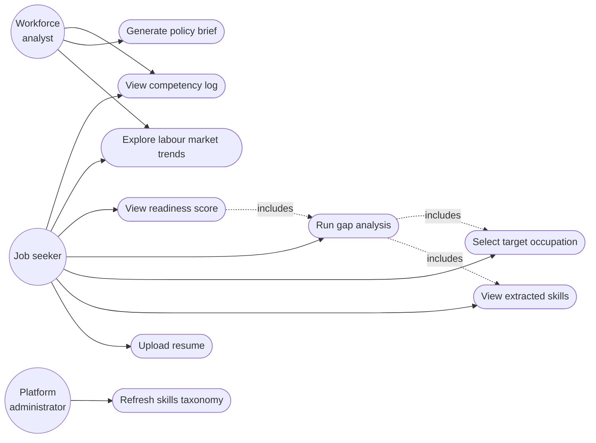
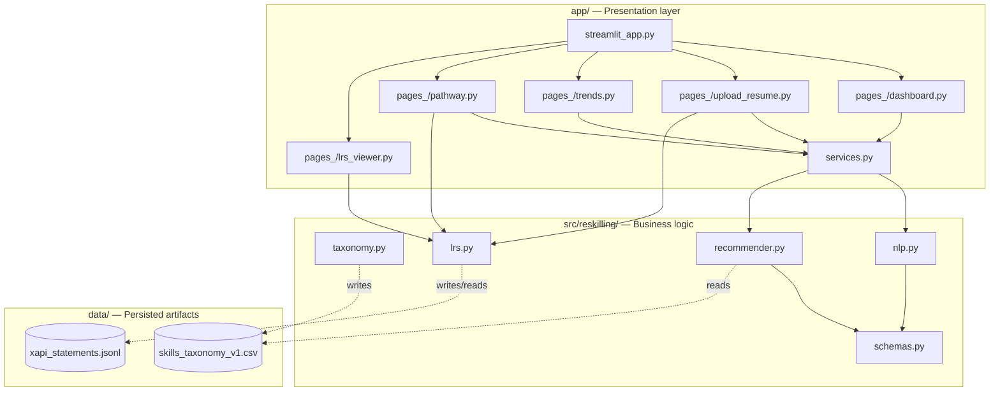
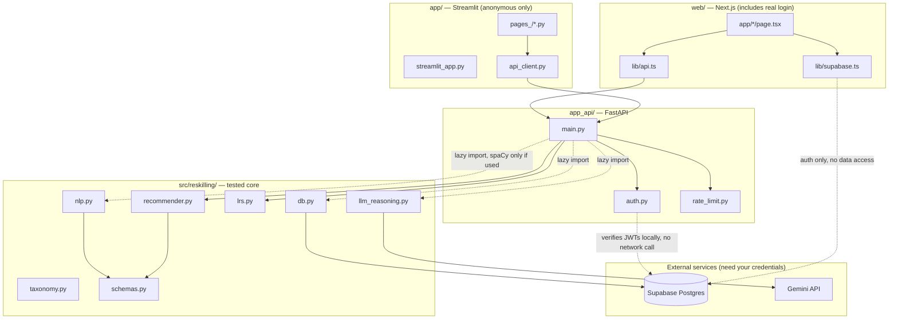

# Architecture diagrams

AI Reskilling Think Tank Platform — Phase 4 documentation deliverable.

> **Update notice:** the diagrams below were accurate as of Phase 4 (Streamlit
> only, no API, no database, no LLM). The platform has since grown through
> Phases A–E — a FastAPI service, a second frontend, Postgres, and Gemini
> reasoning now exist. Rather than silently rewrite this document, the
> original Phase 4 diagrams are preserved below as historical record, and
> **Section 0** describes the current architecture accurately. See
> `Unified_Platform_Architecture_Proposal.docx` Section 8 for the full,
> phase-by-phase decision log this summarizes.

---

## 0. Current system architecture (post Phase E)

```
External data sources (O*NET, ESCO, BLS, ILO, Kaggle)
        |
        v
Processing core -- src/reskilling/
  taxonomy.py -> nlp.py -> recommender.py -> lrs.py
  db.py (Postgres) -- llm_reasoning.py (Gemini)
        |
        v
FastAPI service -- app_api/
  main.py (REST endpoints) -- auth.py (JWT verification)
  rate_limit.py (in-memory, single-instance)
        |
        +----------------------+----------------------+
        v                      v                       v
  Streamlit (app/)      Next.js (web/)          Postgres (Supabase)
  anonymous-only        includes real login     taxonomy + xAPI +
  demo path             (/login, /guidance,      gap-analysis history,
                          /history)               Row Level Security
```

Two things worth highlighting that a diagram alone won't convey:

- **`recommender.py` never imports `nlp.py` directly** (see `schemas.py`) --
  the deterministic gap-analysis path has zero dependency on spaCy, and by
  extension the entire anonymous demo path has zero dependency on either
  spaCy or Gemini being available.
- **The Streamlit app no longer imports `src/reskilling/` at all** -- since
  the Phase A/B migration, every page calls the FastAPI service via
  `app/api_client.py`, exactly as the Next.js app does via `web/lib/api.ts`.
  `app/services.py` (the original cached-local-function approach) is no
  longer used by any page and is kept only as historical reference.

---

## 1. System architecture diagram (Phase 4, historical)

Three-tier architecture:

- **External data sources** (O*NET, ESCO, BLS, ILO, Kaggle) feed the data layer
- **Processing core** (`src/reskilling/`) — `taxonomy.py` underlies both
  `nlp.py` and `recommender.py`; `recommender.py` feeds `lrs.py`
- **Presentation layer** (`app/`) — Streamlit UI, with a cached service layer
  (`services.py`) wrapping the expensive extractor/recommender objects, and a
  local JSONL file (`xapi_statements.jsonl`) as the Learning Record Store output

*(See the rendered version shared earlier in this build session for the full visual. See Section 0 above for the current, accurate architecture.)*

---

## 2. Data pipeline diagram

Sequential data flow, split into a build-time phase and a runtime phase:

**Build-time** (run once per data refresh):
`Raw O*NET text files` -> `taxonomy.py build_taxonomy()` -> `skills_taxonomy_v1.csv`

**Runtime** (runs per user interaction):
`User resume text` -> `nlp.SkillExtractor.extract()` -> `list[SkillMatch]` ->
`recommender.analyze_gap()` -> `lrs.log_gap_analysis_event()` -> `xapi_statements.jsonl`

*(See the rendered version shared earlier in this build session for the full visual.)*

---

## 3. Use case diagram



Three actor roles are modeled, even though only the job-seeker flows are
currently implemented in the codebase:

- **Job seeker** — the primary end user; runs personal skill extraction and
  gap analysis, views their own readiness score and competency log.
- **Workforce analyst** — a secondary persona (NGO staff, policy researcher)
  who consumes aggregate trend data and the policy brief rather than running
  personal assessments. The policy brief generation use case is not yet
  automated in v1.0; the document is currently authored manually using the
  template (see Phase 4 Policy Brief Template deliverable).
- **Platform administrator** — owns taxonomy data refresh, a maintenance
  concern intentionally kept separate from end-user functionality.

---

## 4. Component diagram



**Architectural note**: `recommender.py` depends only on `schemas.py`, never
directly on `nlp.py`. This is a deliberate decoupling decision made during
Phase 2 development — `recommender.py` originally imported `SkillMatch`
directly from `nlp.py`, which transitively forced a spaCy dependency onto
any code (including unit tests) that only needed gap-analysis logic. The
shared dataclass was extracted into the dependency-light `schemas.py` module
specifically to break this coupling. This diagram reflects the actual,
tested codebase as of Phase 3 completion, not an aspirational design.

---

## 5. Component diagram (current, post Phase E)



**What changed since Phase 3, and why it matters:** neither frontend imports
`src/reskilling/` directly anymore — both go through the FastAPI service,
which is the entire point of Phase A. The Next.js app's Supabase client is
used **only** for authentication; it never queries Postgres directly, so
there is exactly one code path (the FastAPI service) responsible for
business logic and data access, not two. Every dependency on `nlp.py`,
`db.py`, and `llm_reasoning.py` inside `main.py` is a lazy, function-scoped
import — the same pattern first established fixing the `recommender.py` /
`nlp.py` coupling in Phase 2, applied consistently at the API layer so that
importing `app_api.main` never requires spaCy, a database connection, or a
Gemini API key to be present.
